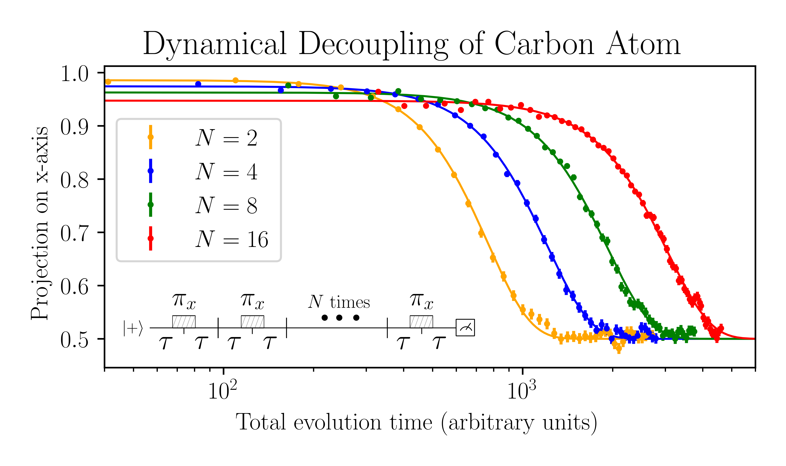

# Final project for the computational physics course in Delft University of Technology.
By [Nicholas Zutt](https://github.com/nicholaszutt) and [Asier Galicia](https://github.com/AGaliciaMartinez).

During the last project project in the course of computational physics in Delft University of Technology we implemented the [Runge Kutta](https://en.wikipedia.org/wiki/Runge%E2%80%93Kutta_methods) algorithm to explore the dynamics of a Nitrogen Vacancy centre and its surrounding C13. We explored how dynamical decoupling techniques[1] can improve the coherence of the system when it suffers time correlated noise in the Magnetic field. Our goal was to obtain a qualitative agreement between simulations and the experiments shown in [1]. The main result we obtain in the simulations can be seen in the following figure,
 
where we plot the polarization of the nuclear spin along the X direcntion and the sequence employed in the simulation. Here, N is the number of decouplings sequences emplyed to protect the nuclear spin. It should be noted that the rotations for the nuclear spin where obtained by doing a dynamical decoupling sequence, this time on the *electron spin*, which when chosen the appropiate interpulse delay, leads to the desire rotation. In this figure we can see that the effect of increasing the number of decoupling sequences is two-fold: it increases the coherence of the system and it decreases the fidelity of the initial state. The increse of the coherence is due to the correlated magnetic noise added whose effect gets mitigated in the dynamical decoupling sequence, whereas the decrease in the fidelity is due to rotations not being ideal.

[1] Abobeih, M.H., Cramer, J., Bakker, M.A. et al. One-second coherence for a single electron spin coupled to a multi-qubit nuclear-spin environment. Nat Commun 9, 2552 (2018). https://doi.org/10.1038/s41467-018-04916-z
